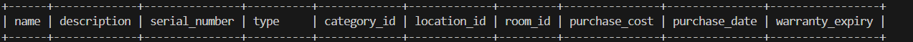

# common
[ ] Validation Style change make a red cross or green tick while validation using js runtime.
[ ] Add Theme option on every page for Light/Dark Button.
[ ] Add Hover Effect.
[ ] toast-container class is adding by self in the page.
[ ] every time while diplaying any kind of date it should be in this form dd/mm/yyyy.

# App
[ ] Add CopyRight in the Footer to fix in every if not content any seprated parts like login page.

# /login
## Login to AMS
[ ] Forget Password CSS Make Proper.
[ ] If Not able to login then fire a query to check the account is registerd or not if not then fire query that your account is not registerd else fire query password not match.
[ ] Add Session to make login and auto logout using Remember me checkbox.
[ ] Put a logo of AMS in circle and put a Simple Login.

## Reset Password
[ ] create a new component.
[ ] Put a logo of AMS in circle and put a Simple Reset Your Password.

# /role-selection
[ ] Make it Landscap for desktop only.
[ ] Make it Grid for tabeles only.

# /register
[ ] Remove the compnent because it is not describe in documentation.

# aside
## Common
[ ] It should be fix in position it should not change hieght as per main-content size
[ ] Add AMS Logo in the left of sidebar-header.
[ ] Remove margin from bottom of sidebar-header.
[ ] Remove padding from top of aside.

## Admin
[ ] Remove margin-bottom css of .sidebar-nav a of rem only not remove margin css that is in px for same.

# main-content
## Admin
### Common changes for Admin
[ ] Change authentication for super adimn role  

### /admin-dashboard
[ ] Add Footer only in main-content to not overwrite in aside
[ ] make css grid-template-columns: repeat(auto-fit, minmax(285px, 1fr)) for .dashboard-stats.
[ ] light and dark theme is not working.
[ ] In Quick Actions put a link tag into a button of seccondary color with secondory text and also put there content in space around and provide some internal padding in buttons.
[ ]  make this and change color and background as need in same way only.

### /employees
[ ] Change the Authentication for view the user.

### /categories
[ ] Remove Add button to open the model.

### /locations
[ ] If user is view locations then not able to view locations button on top only view rooms button.
[ ] Remove add location and room button to view model. 
[ ] Remove Delete Button from the table rows from the action.

### /assets
[ ]  update the table in the given formate.
[ ] in Purchase Date it were showing with time 0 hour 0 min and 0 sec so show only the date.

### /requests
[ ] Remove create request model.

### /maintenance-dashboard
[ ] update CSS. 
[ ] while clicking in the link of quick action it is aking for login.

### /profile
[ ] if user is showing $ then it should always show as label after Profile Management-$ (profile information/change password).
[ ] if user is showing $ then it should not display button for that (profile information/change password).
