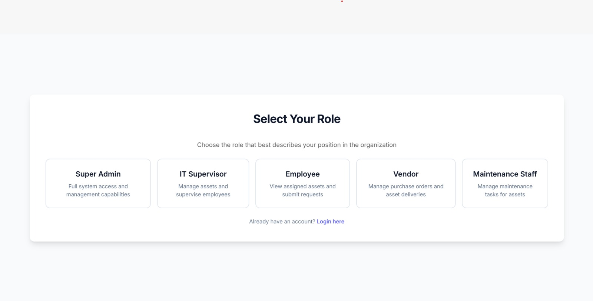
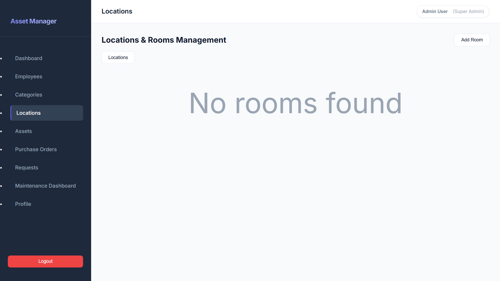

Can't understand ##Reset password:
we have to create a seperate component.

In role selection landscape means horizontal -----   or vertical | ??
And what did you mean by grid:

Don't remove the registration page:
It's my mistake that i have put.

No need to change the authentication:
it is needed because some places puted Admin for authentication check but in database it is Super Admin.

Can't understand #aside what menas in admin employee or .... :
aside means sidebar it is scrolling with main contnt.

##main content can't understand:

#employee 
Change the authentication for view user ??? Employee can't see the users they can only see there assign assets and request status:

#categories can't understand :
we have to remove add button.

#location 
Means the user can't see the location it only see the rooms ?? :

What is view model??

Remove delete button... Why , 

#asstes 
Send image 

#requests
Why??

#maintenance 
Ok np
Api error