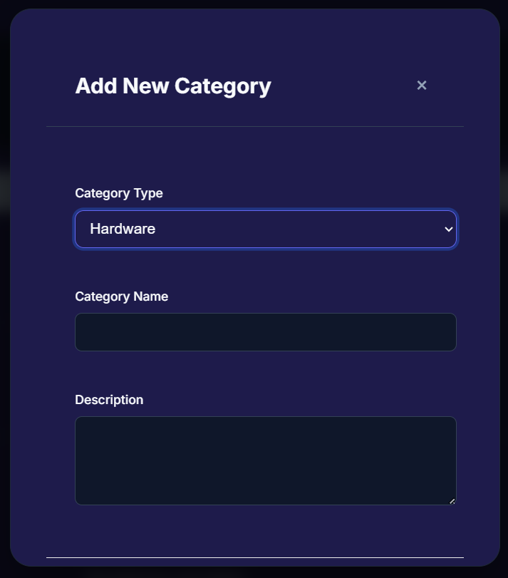
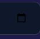

## /rooms?location_id=1
[ ] add Maintaince assets view button at the left of add new room button.

## /team-user?locid=1&roomid=2
[ ] fetch the id of asset at time of assigning it to user and it is set using the help of all details like category-id, location-id.

[ ] users assets model set data view using its filter data only

## /categories
[ ] add/update button when category want to insert or update 
[ ] remove room_id from add asset model

## /assets
[ ]  change color to view in dark mode 

[ ] when assets assign then update assets room_id to assigend user room_id to put data fatch proper 
[ ] check every modal to have model footer and data validation to have add or update button and check modal body work proper

[ ] check /purchase-orders, request after insert into its table then update the asset status to assigned